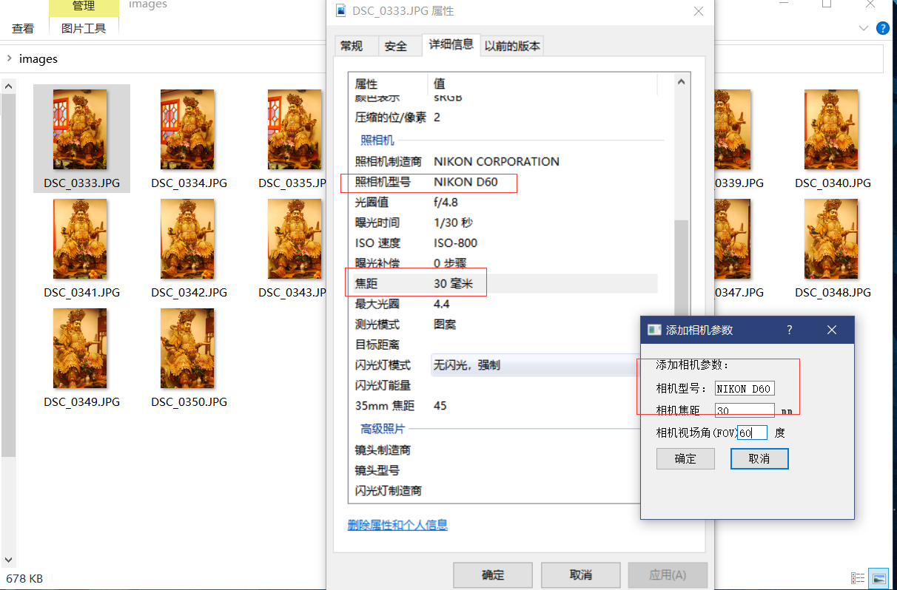
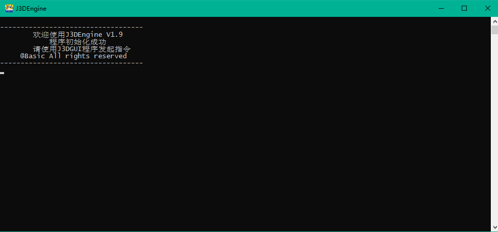
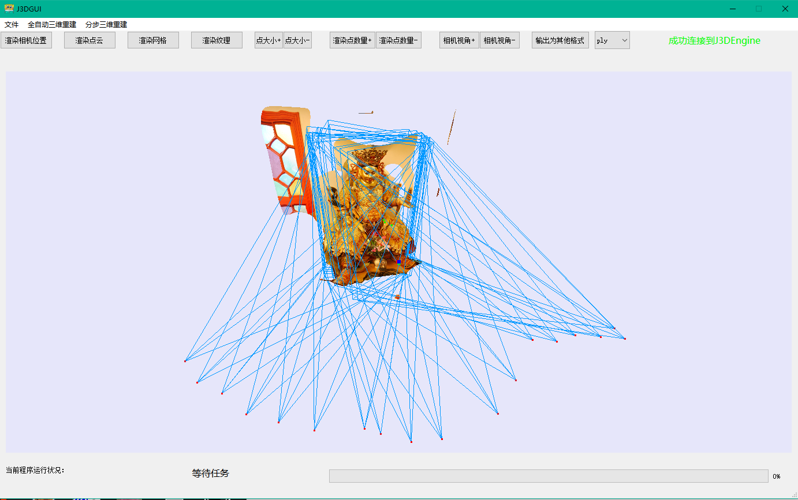

# J3D模型重建系统
#### **J3DReconstruction**

#### 本应用是Windows下基于openMVG+openMVS的三维重建解决方案以及基于Qt的可视化桌面平台

程序为摄影测量影像的三维重建提供解决方案，可将摄影测量的原始影像进行特征匹配重建为三维点云，重建深度图为点云加密，三角网重建，纹理映射，生成纹理模型。

若有幸您能喜欢的话，请为我点上一颗star，谢谢啦。

### 简介

本项目主要是前段时间因学业及项目需要，去鼓捣了一下多目三维重建这个东西，然后其实发现国外开源的框架和库不少，但是由于这个领域比较小众，导致国内的相关文献和实际易于操作的项目确实有点少，我索性就照着openMVG和openMVS两个开源库做了一个二次开发，把开源库大体上的功能封装起来，用qt做了一个windows桌面程序，也免得大家去linux下面编译各种库，在脚本里面跑程序了。本来许多人也并不是为了鼓捣这源码的，只是想看看这些开源库的效果而已嘛。

如果有想在windows下配置环境编译的同学可以fork下来研究研究，由于是个人项目，只是为了实现效果，难免也会有一些bug啦，若是有什么bug或者其他问题可以私信联系我。或者不愿意麻烦的，可以直接下载编译后的二进制程序直接Windows下运行就行，希望给同是研究三维重建这一块儿的同学们帮上一些小忙。

### 功能

#### Function

本应用实现了如下功能：

openMVG库中基于SIFT及其他几种特征子算法的特征提取、特征匹配的封装

openMVG库中提供的全局及增量sfm、sfp、空中三角测量、生成稀疏点云和相机姿态信息的封装

openMVS库中提供的密集点云生成管道封装

openMVS库中提供的三角网模型重建及精炼管道封装

openMVS库中提供的纹理映射管道封装

openMVS库中提供的基于GLFW库的可视化模型预览封装

OSG库中提供的基于openGL库的可视化模型预览及格式转换封装（转换到osgb格式可以在smart3D打开、若本机安装obj2gltf插件可转换到gltf供Cesium加载）

基于空间前方交会的图像像点坐标到实景三维坐标的映射可视化组件

### 构建

#### Build

本项目在开发时的环境如下：

Windows 10 + VisualStudio 2017

openMVG

openMVS

（本项目所用的openMVG、openMVS在原项目的基础上有做细微更改，实际构建使用的代码也在我的仓库中，有需要的同学可以一起使用，若使用原版库，则J3DGUI中预览模型只能使用兼容模式）

openCV（openCV 3.4.1 & openCV 3.4.1_contrib）

VCG:（VCG 1.0.0）

CGAL（CGAL 5.0.2 x64）

Boost（boost_1_67_0-msvc-14.1-64 ）

QT （qt-opensource-windows-x86-5.14.2）

LibQGLViewer（libQGLViewer-2.6.4）

Ceres（ceres-solver-1.14.0）

Eigen （eigen-3.3.7）

GoogleFlags （gflags 2.2.2）

GoogleLog （glog 0.3.3）

CXSParse（CXSParse 3.1.1）

LIBJPEG（jpeg-9d）

GLFW（glfw-3.3.2）

以下的三方库在项目3rd_party目录中附带，无需自行编译安装

OpenSceneGragh（osg 3.4.1）

LIBPNG（libpng 1.6.37）

GLEW（glew-2.1.0）

Windows下构建过程：

1.请将上述库和环境一一构建（该项目基于x64，建议构建x64的库），其中三方库需要在每个vs工程中INSTALL二进制库（INSTALL后库目录会在C盘的Program Files中，不INSTALL也可以，只要能找到具体include目录和lib目录及文件即可）

2.fork并pull本项目到本地，然后在vs中打开本项目代码，（由于需要用到qt，请在vs中下载qt拓展，并配置好相关编译器（我用的是msvc2017_64））

3.检查所有项目（J3DEngine、J3DGUI、J3DMVSEngine、Viewer、CoorIntersector）的项目属性，并检查各个三方库的include目录（C++-常规-附加包含目录）、lib目录（链接器-常规-附加库目录）（链接器-输入-附加依赖项）是否正确（我的三方库统一安装在C:\openMVS下，如果不是安装于此，需要进行相关的修改）

4.按照J3DMVSEngine、Viewer、CoorIntersector、J3DEngine、J3DGUI的顺序，生成各个项目。

### 示例

#### Example

​		构建并编译J3DReconstruction，执行J3DEngine以及J3DGUI应用程序，可实现在J3DGUI程序中可视化调用openMVG及openMVS的构建管道

​		管道中算法实现及介绍可参考openMVG及openMVS的Wiki页面：

​				[https://github.com/cdcseacave/openMVS/wiki]()

​				[https://github.com/openMVG/openMVG/wiki]()

将源图片放在一个文件夹里
若是相机型号比较冷门，需要在文件-添加相机参数中添加相机的几项参数（这个参数可以参考下图去图片元数据中获取，若没有元数据或不齐全，可以去google一下对应相机的具体参数，程序是通过以下公式进行粗略计算的）
$$
sensorWidth = 2 * ( focal * std::tan( (0.5 * FOV)/57.296) );
$$
若是利用焦距/FOV等参数计算不够精确，也可自行获取相机型号及传感器宽度值手动导入SenWidDB.txt

**(※※※注：若SFM步骤时提示There is no defined intrinsic data in order to compute an essential matrix for the initial pair，则说明缺失源图片的相机传感器参数，需要根据以下图片中的情况进行手动添加，否则会SFM重建失败※※※)**

添加之后在SenWidDB.txt中理应也会出现对应的 相机型号;传感器宽度值 

若SenWidDB.txt中无源图片对应的相机型号，会出现SFM重建失败等错误。

当然其实大多数的相机都有预设值，源于官方数据，不需要手动添加的的，具体可以在程序路径中的SenWidDB.txt查询。

我也提供了一组测试图片，在项目的test文件夹中，可自行下载并添加NIKON D60的传感器参数（23.6mm）

 然后在程序中中选择全自动三维重建选项，（若提示无缓存访问权限，请用管理员身份运行）填写源图片路径以及其他参数，确认后即可跟随管道完成重建任务，最终可在J3DGUI程序中可视化查看结果

**（若是全自动出现程序未响应或者其他错误，可以尝试分步进行）**

程序运行结束后，在输出路径中会有对应的重建文件，用J3DGUI或用其他第三方模型预览器打开都可。

可视化预览也支持以下键盘操作

调整视角：鼠标左键按住拖动
调整大小：鼠标滚轮调整
调整视点：鼠标双击模型某 点/面 将其居中
显示相机位置：C键
渲染点云：P键
调整点云中的点大小：A/S键  A键放大 S键缩小
渲染网格：M键
渲染纹理：T键

viewer和convert工具可直接使用OSG库中的osgviewer.exe和osgconv.exe替换程序所需的OSGViewer.exe和osgcv.exe

（或者本项目Release包中也有相应二进制文件可直接使用）

### 版权及证书

#### J3DReconstruction License (include OpenMVG and OpenMVS License)

##### Included third parties license details

This program includes works distributed under the terms of another license(s) and other copyright notice(s).

*   __SeaCave__ 
    Copyright (c) 2007 SEACAVE SRL.
    Licensed under a [Boost license](http://www.boost.org/users/license.html).
*   __easyexif__ 
    [https://github.com/mayanklahiri/easyexif](https://github.com/mayanklahiri/easyexif)
    Copyright (c) 2010 Mayank Lahiri.
    Distributed under the [New BSD License](http://opensource.org/licenses/BSD-3-Clause).
*   __histogram__ 
    Copyright (c) Jansson Consulting & Pierre Moulon.
    Licensed under the [MPL2 license](http://opensource.org/licenses/MPL-2.0).
*   __htmlDoc__ 
    Copyright (c) Pierre Moulon.
    Licensed under the [MPL2 license](http://opensource.org/licenses/MPL-2.0).
*   __ACRANSAC__ 
    Copyright (c) Pierre Moulon.
    Licensed under the [MPL2 license](http://opensource.org/licenses/MPL-2.0).
*   __stlplus3__ 
    [http://stlplus.sourceforge.net](http://stlplus.sourceforge.net)
    Copyright (c) 1999-2004 Southampton University, 2004 onwards Andy Rushton. All rights reserved.
    Licensed under the [BSD license](http://opensource.org/licenses/bsd-license.php).
*   __rectangle-bin-packing__ 
    [http://clb.demon.fi/projects/rectangle-bin-packing](http://clb.demon.fi/projects/rectangle-bin-packing)
    Copyright (c) Jukka Jylänki.
    Released to Public Domain, do whatever you want with it.
*   __ceres-solver__ 
    [http://ceres-solver.org](http://ceres-solver.org)
    Copyright 2015 Google Inc. All rights reserved.
    Licensed under the [New BSD license](http://ceres-solver.org/license.html).
*   __lmfit__ 
    [http://apps.jcns.fz-juelich.de/doku/sc/lmfit](http://apps.jcns.fz-juelich.de/doku/sc/lmfit)
    Copyright (c) Joachim Wuttke.
    Licensed under the [FreeBSD license](http://opensource.org/licenses/BSD-2-Clause).
*   __TRWS__ 
    [http://pub.ist.ac.at/~vnk/software.html](http://pub.ist.ac.at/~vnk/software.html)
    Copyright (c) Vladimir Kolmogorov.
    Licensed under the [MSR-SSLA license](http://research.microsoft.com/en-us/um/people/antr/vrr/vrr/license.htm).
*   __ibfs__ 
    [http://www.cs.tau.ac.il/~sagihed/ibfs](http://www.cs.tau.ac.il/~sagihed/ibfs)
    Copyright (c) Haim Kaplan and Sagi Hed.
    This software can be used for research purposes only.
*   __loopy-belief-propagation__ 
    [https://github.com/nmoehrle/mvs-texturing](https://github.com/nmoehrle/mvs-texturing)
    Copyright (c) Michael Waechter.
    Licensed under the [BSD 3-Clause license](http://opensource.org/licenses/BSD-3-Clause).
*   __eigen__ 
    [http://eigen.tuxfamily.org](http://eigen.tuxfamily.org)
    Copyright (c) Eigen authors.
    Distributed under the [MPL2 license](http://opensource.org/licenses/MPL-2.0).
    Compiled with EIGEN_MPL2_ONLY to ensure MPL2 compatible code.
*   __OpenCV__ 
    [http://opencv.org](http://opencv.org)
    Copyright (c) 2015, Itseez.
    Licensed under the [BSD license](http://opensource.org/licenses/bsd-license.php).
*   __Boost__ 
    [http://www.boost.org](http://www.boost.org)
    Copyright Beman Dawes, David Abrahams, 1998-2005.
    Copyright Rene Rivera 2004-2007.
    Licensed under a [Boost license](http://www.boost.org/users/license.html).
*   __CGAL__ 
    [http://www.cgal.org](http://www.cgal.org)
    Copyright (c) 1995-2015 The CGAL Project. All rights reserved.
    Licensed under the [GPL](http://www.gnu.org/copyleft/gpl.html)/[LGPL license](http://www.gnu.org/copyleft/lesser.html).
*   **cmdLine**
    Copyright (c) Pascal Monasse. Licensed under the [MPL2 license](http://opensource.org/licenses/MPL-2.0).
*   **CppUnitLite** (optional)
    Public domain.
*   **cxsparse** (optional)
    Copyright (c) 2006-2012, Timothy A. Davis. Distributed under the [GNU LGPL license](http://opensource.org/licenses/lgpl-license).
*   **easyexif**
    Copyright (c) 2010 Mayank Lahiri. Distributed under the [New BSD License](http://opensource.org/licenses/BSD-3-Clause).
*   **fast**
    Copyright (c) 2006, 2008 Edward Rosten Distributed under the [New BSD License](https://opensource.org/licenses/BSD-3-Clause).
*   **flann**
    Copyright (c) 2008-2011 Marius Muja ([mariusm@cs.ubc.ca](mailto:mariusm@cs.ubc.ca)). All rights reserved. Copyright (c) 2008-2011 David G. Lowe ([lowe@cs.ubc.ca](mailto:lowe@cs.ubc.ca)). All rights reserved. Distributed under the [BSD License](http://www.opensource.org/licenses/bsd-license.php).
*   **histogram**
    Copyright (c) Jansson Consulting & Pierre Moulon. Licensed under the [MPL2 license](http://opensource.org/licenses/MPL-2.0).
*   **hnswlib**
    Copyright (c) hnswlib authors. Licensed under the [Apache-2.0 license](https://opensource.org/licenses/Apache-2.0).
*   **htmlDoc**
    Copyright (c) Pierre Moulon. Licensed under the [MPL2 license](http://opensource.org/licenses/MPL-2.0).
*   **jpeg**
    Copyright (c) Independent JPEG Group License. Licensed under the [Independent JPEG Group License](https://spdx.org/licenses/IJG).
*   **lemon**
    Copyright (c) Lemon authors. Licensed under the [Boost License 1.0](http://www.boost.org/LICENSE_1_0.txt).
*   **png** (optional)
    Copyright (c) 2004, 2006-2015 Glenn Randers-Pehrson Licensed under the [lib png license](http://www.libpng.org/pub/png/src/libpng-LICENSE.txt).
*   **progress**
    Copyright (c) Pierre MOULON Licensed under the [MPL2 license](http://opensource.org/licenses/MPL-2.0).
*   **stlplus3**
    Copyright (c) 1999-2004 Southampton University, 2004 onwards Andy Rushton. All rights reserved. Licensed under the [BSD license](http://opensource.org/licenses/bsd-license.php).
*   **tiff** (optional)
    Copyright (c) 1988-1997 Sam Leffler Copyright (c) 1991-1997 Silicon Graphics, Inc. Licensed under a BSD-like license.
*   **vectorGraphics**
    Copyright (c) Pierre Moulon Licensed under the [MPL2 license](http://opensource.org/licenses/MPL-2.0).
*   **zlib** (optional)
    Copyright (C) 1995-2005 Jean-loup Gailly Licensed under the [zlib license](http://opensource.org/licenses/Zlib).
*   **OpenSceneGragh**
    Copyright (C) 2018 Robert Licensed under the [OSG license](https://github.com/openscenegraph/OpenSceneGraph/blob/master/LICENSE.txt).

